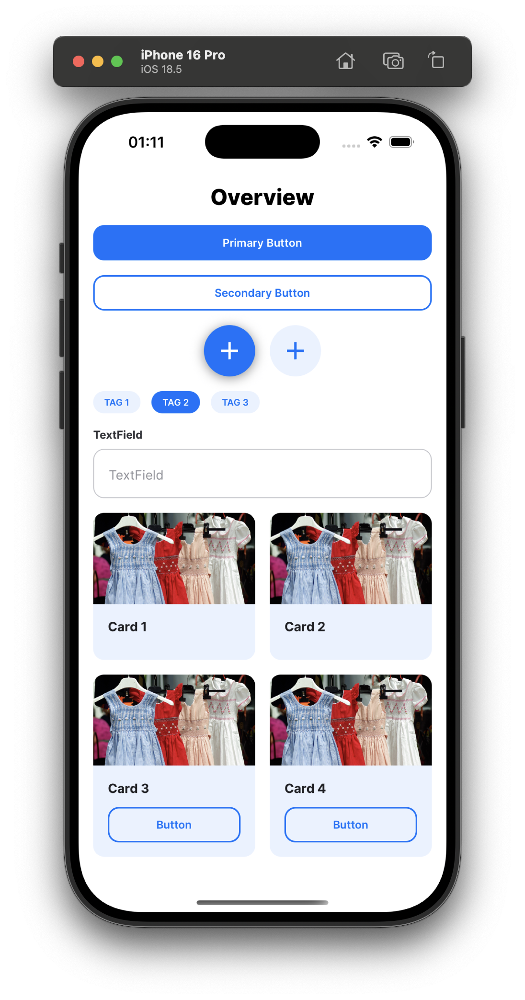

# Cross Assignment 3 - React Native Components

A React Native project showcasing various UI components built with Expo and TypeScript.

## 🚀 Setup and Launch

### Prerequisites

- Node.js (v18 or higher)
- pnpm package manager
- Expo CLI (`npm install -g @expo/cli`)
- iOS Simulator (for iOS development), Android Emulator (for Android development), or Expo Go app

### Installation

1. Clone the repository
2. Install dependencies:

   ```bash
   pnpm install
   ```

### Running the Project

- **Start development server:**

  ```bash
  pnpm start
  ```

- **Run on iOS:**

  ```bash
  pnpm ios
  ```

- **Run on Android:**

  ```bash
  pnpm android
  ```

- **Run on Web:**

  ```bash
  pnpm web
  ```

## 🧩 Components

The project includes the following reusable components:

### Core Components

- **Button** - Primary and secondary button variants
- **Card** - Image card with optional button
- **CardsGrid** - n-column grid layout for cards
- **Fab** - Floating Action Button with icon support
- **Tag** - Individual tag component
- **Tags** - Horizontal tag list with selection
- **TextField** - Input field with label

### Component Screenshots

**Phone View:**


**Tablet View:**


## 🛠️ Tech Stack

- **Framework:** React Native with Expo
- **Language:** TypeScript
- **Package Manager:** pnpm
- **Navigation:** React Navigation
- **Styling:** React Native StyleSheet with design system constants

## 📁 Project Structure

```text
cross_assignment_3/
├── components/          # Reusable UI components
├── constants/           # Design system (colors, fonts, spacing)
├── screens/             # Screen components
├── navigation/          # Navigation configuration
├── assets/              # Images and static assets
└── docs/               # Documentation and assets
```

## 🎨 Design System

The project uses a centralized design system with:

- Consistent color palette
- Typography scale
- Spacing system
- Component variants

## 📱 Available Scripts

- `pnpm start` - Start Expo development server
- `pnpm ios` - Run on iOS simulator
- `pnpm android` - Run on Android emulator
- `pnpm web` - Run on web browser
- `pnpm lint` - Run ESLint and Prettier checks
- `pnpm format` - Format code with Prettier
